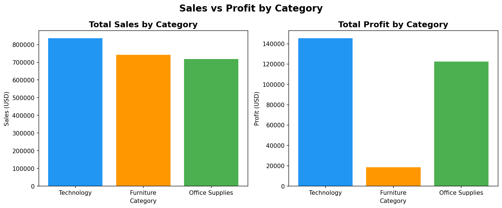
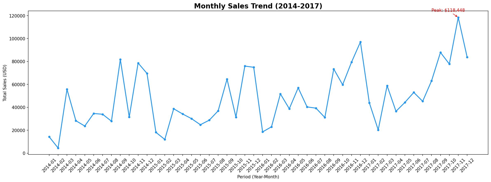
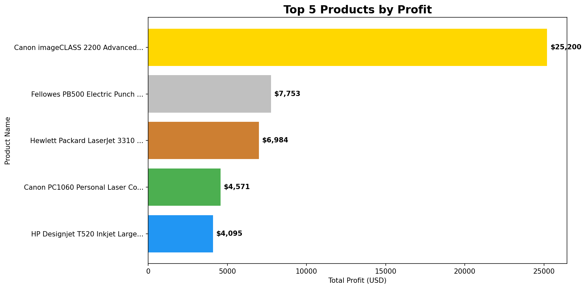
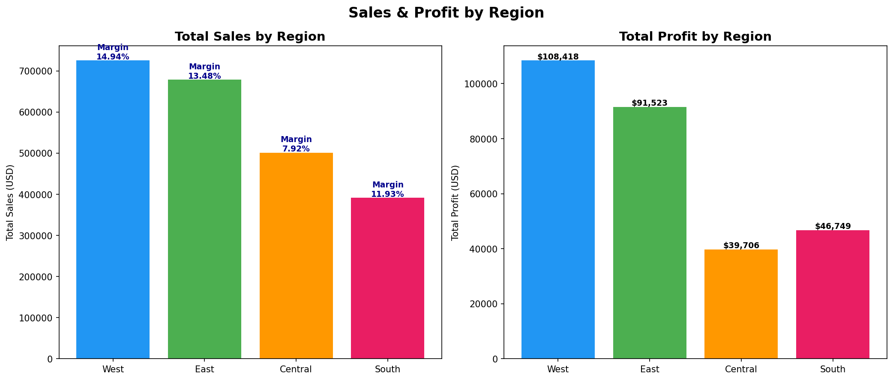
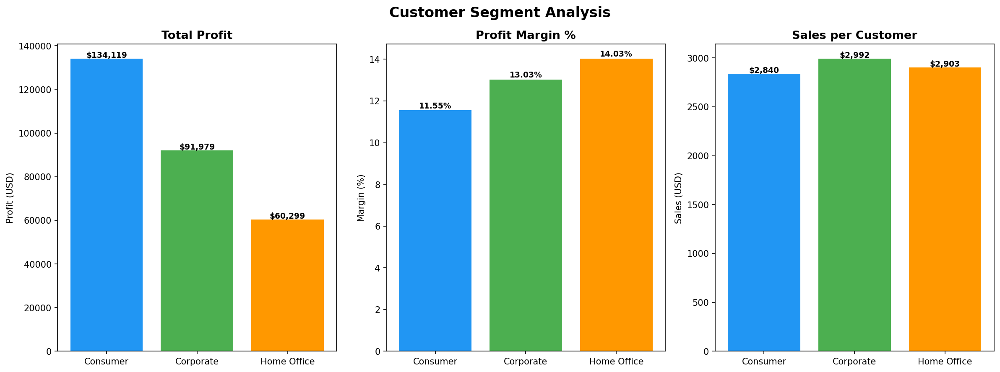
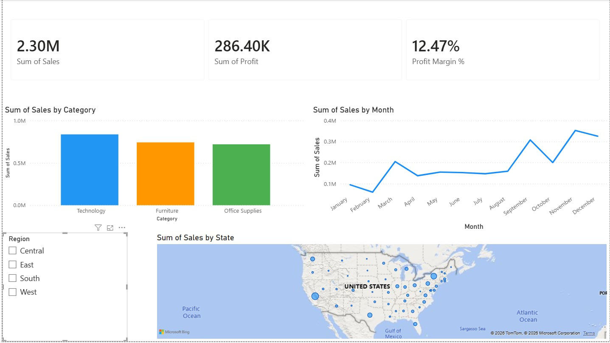
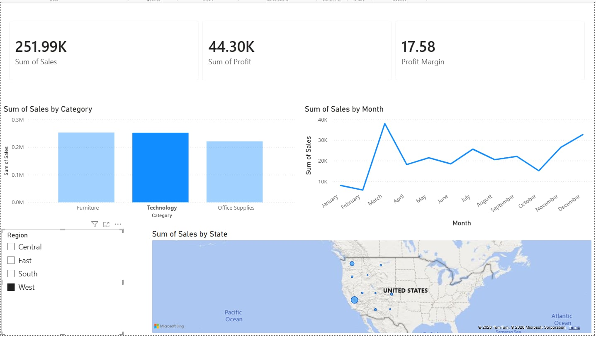
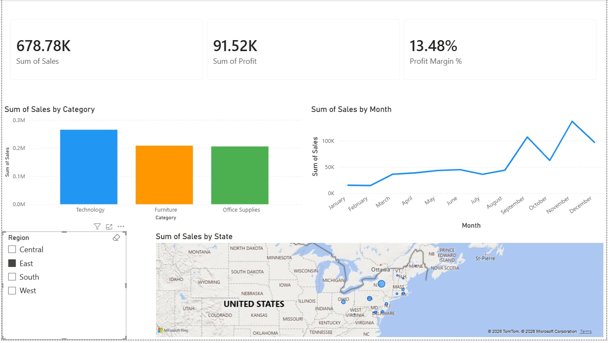
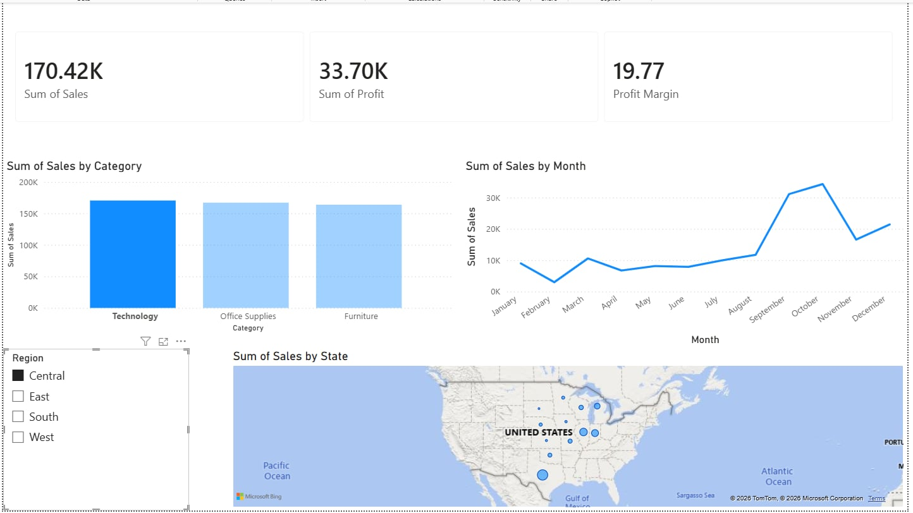
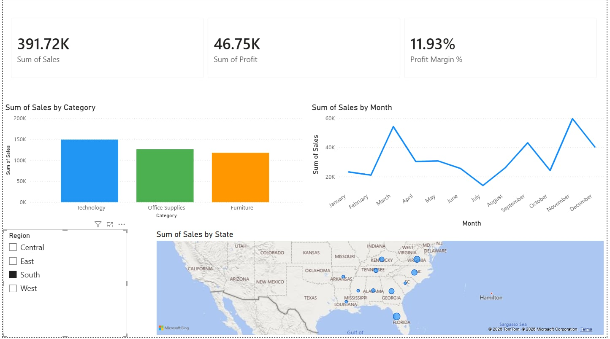

# 🛒 Superstore Sales Analysis

## 📌 Project Overview
SQL + Python analysis of 9,994 sales transactions to uncover business insights
across product categories, regions, and customer segments.

**Tools:** Python, Pandas, SQLite, Matplotlib, Google Colab
**Dataset:** Superstore Sales Dataset (Kaggle)

---

## 🔍 Key Findings

| # | Insight | Detail |
|---|---------|--------|
| 1 | Technology drives profit | Highest margin at 17.4% — 4 of top 5 products |
| 2 | Clear seasonality | Peak in November every year — plan stock accordingly |
| 3 | Furniture is a weak spot | Only 2.5% margin — Central Region sells at a loss (-1.75%) |
| 4 | Central Region underperforms | Margin 7.92% vs West 14.94% — discount policy issue |
| 5 | Corporate is the best segment | Highest Sales per Customer at $2,992 |

---

## 📊 Visualizations

### Sales & Profit by Category

### Monthly Sales Trend (2014-2017)

### Top 5 Products by Profit

### Sales & Profit by Region

### Customer Segment Analysis

---

## 📁 Project Structure
## 💡 Business Recommendations
1. **Furniture** — Review discount policy, especially in Central Region
2. **Central Region** — Stop discounting Furniture, push Technology sales
3. **Canon imageCLASS** — Target Corporate segment with demo/ROI presentation
4. **Low Season** — Run promotions in Jan-Feb to boost slow months
5. **Corporate Segment** — Prioritize for highest Sales per Customer

---
*Project by Sarunsx | Data Analyst Portfolio*
## Dashboard Preview

### Overall

### By Region
| West | East |
|---|---|
|  |  |

| Central | South |
|---|---|
|  |  |
